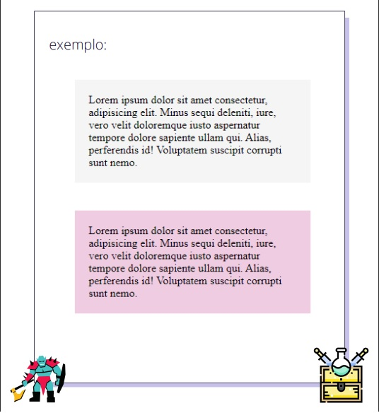

 # Projeto Parágrafos Coloridos

## Descrição do projeto

### 📍 Criar 2 parágrafos:
- Exercício 3 HTML/CSS do curso DevQuest 2022 
- Cor de fundo diferente em cada um:
    - Parágrafo de estilo padrão com fundo cinza claro (#f5f5f5).
    - Parágrafo de estilo destacado com fundo colorido (#f0cce2).

- Espaçamento entre um parágrafo e outro de 40px.

- Espaçamento interno de 20px.

- Aplique o fundo nos parágrafos de forma que facilite a manutenção caso mais parágrafos sejam adicionados no futuro.

### 📍Exemplo
[]

## Tecnologias utilizadas:
- HTML
- CSS

## Data da última atualização

- 27/09/2022